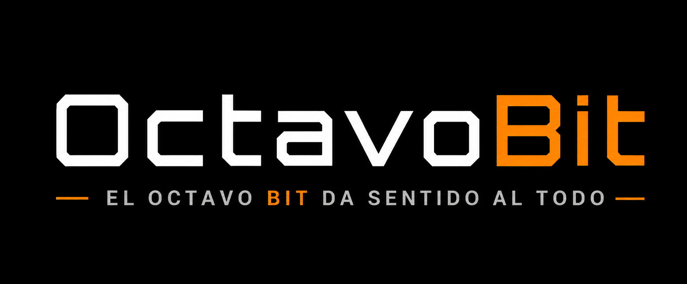

  

# 👋 Hola, soy Víctor

### Fundador de OctavoBit

Desarrollador Full Stack especializado en:

.NET • Java • Android • Azure • IA • Automatización • Cloud

---

## 🚀 Sobre mí

Soy desarrollador de software con experiencia en:

- APIs REST en .NET
- Java Spring Boot
- Android Kotlin
- Azure AI
- Azure Key Vault
- Automatización RPA
- Elastic Search & RAG
- Docker y Proxmox
- Cloudflare

Actualmente trabajo en proyectos relacionados con:

- Inteligencia Artificial
- Automatización documental
- Integraciones empresariales
- SEO/GEO impulsado por IA

---

## 🛠 Tecnologías

---

## ⭐ Proyectos Destacados

### OctoJ
Gestor avanzado de versiones Java para Windows.

### EdasNeo IA
Procesamiento inteligente de notificaciones electrónicas mediante IA.

### RAG Framework
Motor de búsqueda documental basado en Elastic + IA.

### Cloud Automation
Automatización de despliegues y servicios cloud.

---

## 📈 Estadísticas

---

## 🌐 Contacto

- Web: https://octavobit.es
- LinkedIn: https://linkedin.com/in/...
- Email: contacto@octavobit.es
