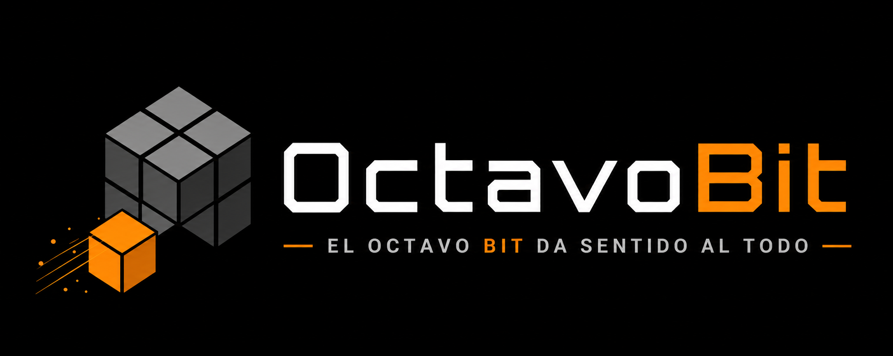

  <picture>
    <source media="(prefers-color-scheme: dark)" srcset="assets/banner-dark.png">
    <source media="(prefers-color-scheme: light)" srcset="assets/banner-light.png">
    
  </picture>

# 👋 Hola, soy Víctor

### Fundador de OctavoBit

Desarrollador Full Stack especializado en:

.NET • Java • Android • Azure • IA • Automatización

---

## 🚀 Sobre mí

Soy desarrollador de software con experiencia en:

- APIs REST en .NET
- Java Spring Boot
- Android Kotlin
- Azure AI
- Azure Key Vault
- Automatización RPA
- Elastic Search & RAG
- Docker y Proxmox
- Cloudflare

Actualmente trabajo en proyectos relacionados con:

- Inteligencia Artificial
- Automatización documental
- Integraciones empresariales
- SEO/GEO impulsado por IA

---

## 🛠 Tecnologías

---